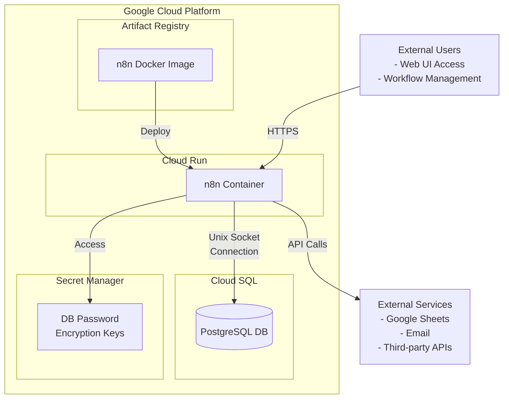
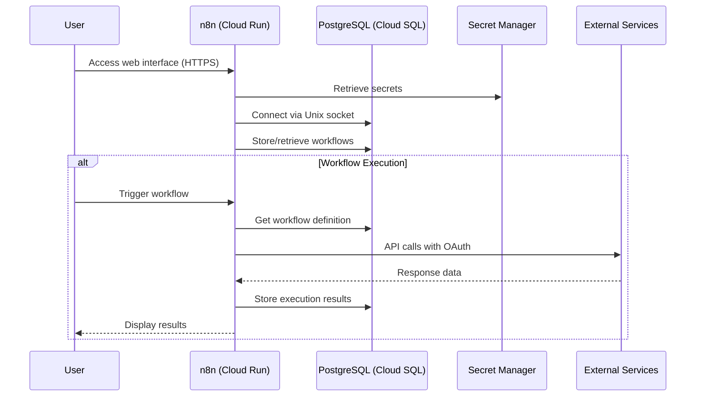

# Self-Hosting n8n on Google Cloud Run: Complete Guide

## Architecture Overview



### Architecture Components

#### Google Cloud Platform Resources

1. **Cloud Run**

   - Hosts the n8n container
   - Scales to zero when not in use (cost-efficient)
   - Handles HTTPS traffic
   - Connects to Cloud SQL via Unix socket

2. **Cloud SQL**

   - PostgreSQL 15 database
   - Stores workflows, credentials, executions
   - db-f1-micro tier (cost-efficient)
   - Persistent storage

3. **Secret Manager**

   - Securely stores sensitive information
   - Database password
   - n8n encryption key

4. **Artifact Registry**
   - Stores the custom n8n Docker image
   - Enables versioning and deployment

#### External Components

1. **User Access**

   - Web browser interface
   - Workflow creation and management
   - OAuth authentication for Google services

2. **External Services**
   - Integration with Google services (Sheets, Drive)
   - Other third-party services via n8n nodes

#### Data Flow



1. User requests are sent to Cloud Run over HTTPS
2. n8n container processes requests and connects to PostgreSQL for data
3. Workflows execute within the container or via task runners
4. External service connections use OAuth credentials stored in n8n

This guide documents a production-ready n8n deployment on Google Cloud Run with PostgreSQL persistence.

Following this guide will give you a fully functional system that scales automatically, connects to Google services via OAuth, and won't drain your wallet when idle.

> **🚀 Quick Start Option**: Want to skip the manual setup? Jump to the [Terraform Deployment Option](#terraform-deployment-option) section for a streamlined, automated deployment. Terraform can handle all the heavy lifting for you!

## Table of Contents

- [Architecture Overview](#architecture-overview)
- [Quick Start with Terraform](#terraform-deployment-option)
- [Manual Step-by-Step Guide](#step-1-set-up-your-google-cloud-project)
- [Configuration](#step-8-configure-n8n-for-oauth-with-google-services)
- [Updates & Maintenance](#keeping-n8n-updated-dont-be-that-person-running-year-old-software)
- [Troubleshooting](#troubleshooting)

## Overview

- Google Cloud Run for hosting the application (pay only when it runs)

- Cloud SQL PostgreSQL for database persistence (because your workflows should survive restarts)

- Google Auth Platform for connecting to Google services (sheets, drive, etc.)

Why self-host? Complete control over your automation workflows and data. No arbitrary execution limits. No wondering where your sensitive data is being stored. And with Cloud Run, you get the best of both worlds - the control of self-hosting with the convenience of not having to manage actual servers.

## Prerequisites

Before diving in, make sure you've got:

- A Google Cloud account (they offer a generous free tier for new accounts)

- gcloud CLI installed and configured (trust me, it's worth not clicking through web consoles)

- Basic familiarity with Docker and command line

- A domain name (optional, but recommended for production use)

The command line approach might seem intimidating at first, but it means we can script the entire deployment process. And when you need to update or recreate your instance, you'll thank yourself for having everything in a reusable format.

## Step 1: Set Up Your Google Cloud Project

First, let's get our Google Cloud environment sorted:

```bash
# First, update the .env_setup.sh file with your project details
# Then source the environment variables
source .env_setup.sh

# Logging in to gcloud
gcloud auth login

# Setting your active project
gcloud config set project $PROJECT_ID

# Enabling required APIs
gcloud services enable artifactregistry.googleapis.com
gcloud services enable run.googleapis.com
gcloud services enable sqladmin.googleapis.com
gcloud services enable secretmanager.googleapis.com
```

These commands establish your project environment and enable the necessary Google Cloud APIs. We're turning on all the services we'll need upfront to avoid those annoying "please enable this API first" errors later.

## Step 2: Create a Custom Dockerfile and Startup Script for n8n

Here's where things get interesting. Cloud Run and n8n have a bit of a disagreement about ports - one expects containers to use a specific `PORT` environment variable, while n8n uses its own system. We need to bridge that gap.

Create these two files in your working directory:

**startup.sh:**

```bash
#!/bin/sh

# Map Cloud Run's PORT to N8N_PORT if it exists
if [ -n "$PORT" ]; then
  export N8N_PORT=$PORT
fi

# Print environment variables for debugging
echo "Database settings:"
echo "DB_TYPE: $DB_TYPE"
echo "DB_POSTGRESDB_HOST: $DB_POSTGRESDB_HOST"
echo "DB_POSTGRESDB_PORT: $DB_POSTGRESDB_PORT"
echo "N8N_PORT: $N8N_PORT"

# Start n8n with its original entrypoint
exec /docker-entrypoint.sh
```

**Dockerfile:**

```Dockerfile
FROM docker.n8n.io/n8nio/n8n:latest

# Copy the script and ensure it has proper permissions
COPY startup.sh /
USER root
RUN chmod +x /startup.sh
USER node
EXPOSE 5678

# Use shell form to help avoid exec format issues
ENTRYPOINT ["/bin/sh", "/startup.sh"]
```

This custom setup solves the port mismatch problem and helps with debugging. Without it, you'd just see a failed container with no helpful error messages. And yes, that's exactly as frustrating as it sounds.

- If you run into problems with this step, check that:

- Your `startup.sh` file has Unix-style line endings (LF, not CRLF)

- The file has proper execute permissions

## Step 3: Set Up a Container Repository

Let's create a place to store our container image:

```bash
# Create a repository in Artifact Registry
gcloud artifacts repositories create $AR_REPO_NAME \
    --repository-format=docker \
    --location=$REGION \
    --description="Repository for n8n workflow images"

# Configure Docker to use gcloud as a credential helper
gcloud auth configure-docker $REGION-docker.pkg.dev

# Build and push your image
docker build --platform linux/amd64 --pull --no-cache -t $REGION-docker.pkg.dev/$PROJECT_ID/$AR_REPO_NAME/$SERVICE_NAME:latest .
docker push $REGION-docker.pkg.dev/$PROJECT_ID/$AR_REPO_NAME/$SERVICE_NAME:latest
```

We're explicitly building for linux/amd64 because Cloud Run doesn't support ARM architecture. This is particularly important if you're developing on an M1/M2 Mac - Docker will happily build an ARM image by default, which then fails mysteriously when deployed. Ask me how I know.

## Step 4: Set Up Cloud SQL PostgreSQL Instance

Now for the database. We'll use the smallest instance type to keep costs reasonable:

```bash
# Creating a Cloud SQL instance (lowest cost tier)
gcloud sql instances create n8n-db \
    --database-version=POSTGRES_15 \
    --tier=db-f1-micro \
    --region=$REGION \
    --root-password=$N8NDBPASS \
    --storage-size=10GB \
    --availability-type=ZONAL \
    --no-backup \
    --storage-type=HDD

# Creating a database
gcloud sql databases create $DB_POSTGRESDB_DATABASE --instance=n8n-db

# Creating a user for n8n
gcloud sql users create $DB_POSTGRESDB_USER \
    --instance=n8n-db \
    --password=$N8NDBPASS
```

The db-f1-micro tier is perfect for most personal n8n deployments. I've run hundreds of workflows on this setup without issue. And you can always upgrade later if needed.

## Step 5: Create Secrets for Sensitive Data

Never put passwords in your deployment configuration. Let's use Secret Manager instead:

```bash
# Creating a secret for the database password
echo -n $N8NDBPASS | \
    gcloud secrets create n8n-db-password \
    --data-file=- \
    --replication-policy="automatic"

# Creating a secret for n8n encryption key
echo -n $N8NDBENCRYPTIONKEY | \
    gcloud secrets create n8n-encryption-key \
    --data-file=- \
    --replication-policy="automatic"
```

That encryption key is particularly important - it protects all the credentials stored in your n8n instance. Make it long, random, and keep it safe. If you lose it, you'll need to reconfigure all your connected services.

## Step 6: Create a Service Account for Cloud Run

Time to set up the identity your n8n instance will use:

```bash
# Creating a service account
gcloud iam service-accounts create n8n-service-account \
    --display-name="n8n Service Account"

# Granting access to secrets
gcloud secrets add-iam-policy-binding n8n-db-password \
    --member="serviceAccount:n8n-service-account@$PROJECT_ID.iam.gserviceaccount.com" \
    --role="roles/secretmanager.secretAccessor"

gcloud secrets add-iam-policy-binding n8n-encryption-key \
    --member="serviceAccount:n8n-service-account@$PROJECT_ID.iam.gserviceaccount.com" \
    --role="roles/secretmanager.secretAccessor"

# Granting Cloud SQL Client role
gcloud projects add-iam-policy-binding $PROJECT_ID \
    --member="serviceAccount:n8n-service-account@$PROJECT_ID.iam.gserviceaccount.com" \
    --role="roles/cloudsql.client"
```

Following the principle of least privilege here means your n8n service can access exactly what it needs and nothing more. It's a small thing that makes a big difference to your security posture.

## Step 7: Deploy to Cloud Run

The moment of truth - let's deploy n8n:

```bash
# Getting the connection name for your Cloud SQL instance
export SQL_CONNECTION=$(gcloud sql instances describe n8n-db --format="value(connectionName)")

# Deploying to Cloud Run
gcloud run deploy $SERVICE_NAME \
    --image=$REGION-docker.pkg.dev/$PROJECT_ID/$AR_REPO_NAME/$SERVICE_NAME:latest \
    --platform=managed \
    --region=$REGION \
    --allow-unauthenticated \
    --port=5678 \
    --cpu=2 \
    --memory=2Gi \
    --min-instances=0 \
    --max-instances=1 \
    --set-env-vars="N8N_PATH=$N8N_PATH,N8N_PORT=$N8N_PORT,N8N_PROTOCOL=$N8N_PROTOCOL,DB_TYPE=$DB_TYPE,DB_POSTGRESDB_DATABASE=$DB_POSTGRESDB_DATABASE,DB_POSTGRESDB_USER=$DB_POSTGRESDB_USER,DB_POSTGRESDB_HOST=/cloudsql/$SQL_CONNECTION,DB_POSTGRESDB_PORT=$DB_POSTGRESDB_PORT,DB_POSTGRESDB_SCHEMA=$DB_POSTGRESDB_SCHEMA,N8N_USER_FOLDER=$N8N_USER_FOLDER,EXECUTIONS_PROCESS=$EXECUTIONS_PROCESS,EXECUTIONS_MODE=$EXECUTIONS_MODE,GENERIC_TIMEZONE=$GENERIC_TIMEZONE,QUEUE_HEALTH_CHECK_ACTIVE=$QUEUE_HEALTH_CHECK_ACTIVE,N8N_DIAGNOSTICS_ENABLED=$N8N_DIAGNOSTICS_ENABLED,N8N_DIAGNOSTICS_CONFIG_BACKEND=$N8N_DIAGNOSTICS_CONFIG_BACKEND,N8N_LOG_LEVEL=$N8N_LOG_LEVEL,N8N_PROXY_HOPS=$N8N_PROXY_HOPS,N8N_RUNNERS_ENABLED=$N8N_RUNNERS_ENABLED" \
    --set-secrets="DB_POSTGRESDB_PASSWORD=n8n-db-password:latest,N8N_ENCRYPTION_KEY=n8n-encryption-key:latest" \
    --add-cloudsql-instances=$SQL_CONNECTION \
    --service-account=n8n-service-account@$PROJECT_ID.iam.gserviceaccount.com
```

After deployment, Cloud Run will provide a URL for your n8n instance. Note it down - you'll need it for the next steps.

A word on the configuration: setting min-instances to 0 and max-instances to 1 means your service will scale down to nothing when not in use (saving you money) but won't run multiple instances simultaneously (which can cause database conflicts with n8n). The CPU and memory allocation is enough for most workflows without going overboard on cost.

### n8n Google Cloud Run Environment Variables

Here's what all those environment variables do:

```md
|   Environment Variable    |            Value            |                                 Description                                  |
| :-----------------------: | :-------------------------: | :--------------------------------------------------------------------------: |
|         N8N_PATH          |              /              |                    Base path where n8n will be accessible                    |
|         N8N_PORT          |             443             |     External port (set to 443 for proper OAuth callback URL generation)      |
|       N8N_PROTOCOL        |            https            |                      Protocol used for external access                       |
|    N8N_RUNNERS_ENABLED    |            true             |            Enables task runners (required for newer n8n versions)            |
|          DB_TYPE          |         postgresdb          | Must be exactly "postgresdb" (not postgresql) for proper database connection |
|  DB_POSTGRESDB_DATABASE   |             n8n             |                       Name of the PostgreSQL database                        |
|    DB_POSTGRESDB_USER     |          n8n-user           |                              Database user name                              |
|    DB_POSTGRESDB_HOST     | /cloudsql/[connection-name] |        PostgreSQL connection path using Cloud SQL Unix socket format         |
|    DB_POSTGRESDB_PORT     |            5432             |                           Standard PostgreSQL port                           |
|   DB_POSTGRESDB_SCHEMA    |           public            |           Required for n8n to properly initialize database tables            |
|      N8N_USER_FOLDER      |       /home/node/.n8n       |                            Location for n8n data                             |
|     GENERIC_TIMEZONE      |             UTC             |                Default timezone for consistent time handling                 |
|    EXECUTIONS_PROCESS     |            main             |                Set to "main" for single-container deployment                 |
|      EXECUTIONS_MODE      |           regular           |                     Controls workflow execution behavior                     |
| QUEUE_HEALTH_CHECK_ACTIVE |            true             |              Critical for Cloud Run to verify container health               |
```

Pay special attention to DB_TYPE. It must be "postgresdb" not "postgresql" - a quirk that's caused many deployment headaches. And don't explicitly set the PORT variable as Cloud Run injects this automatically.

## Step 8: Configure n8n for OAuth with Google Services

Now we need to update the deployment with environment variables that tell n8n how to properly generate URLs for OAuth callbacks:

```bash
# Getting your service URL (replace with your actual URL)
export SERVICE_URL="https://n8n-YOUR_ID.REGION.run.app" # https://n8n-163872509733.us-central1.run.app

# Updating the deployment with proper URL configuration
gcloud run services update $SERVICE_NAME \
    --region=$REGION \
    --update-env-vars="N8N_HOST=$(echo $SERVICE_URL | sed 's/https:\/\///'),WEBHOOK_URL=$SERVICE_URL,N8N_EDITOR_BASE_URL=$SERVICE_URL"
```

Without these variables, OAuth would fail with utterly unhelpful "redirect_uri_mismatch" errors that make you question your life choices. Setting them correctly means n8n can construct proper callback URLs during authentication flows.

For newer versions of n8n use `WEBHOOK_URL` instead of `N8N_WEBHOOK_URL`.

## Step 9: Set Up Google OAuth Credentials

Finally, to connect n8n with Google services like Sheets:

1. Access the Google Cloud Console:
   - Navigate to the Google Cloud Console
   - Select your project
2. Enable Required APIs:
   - Go to "APIs & Services" > "Library"
   - Search for and enable the APIs you need (e.g., "Google Sheets API", "Google Drive API")
3. Configure OAuth Consent Screen:

   - Go to "APIs & Services" > "OAuth consent screen
   - Select "External" user type (or "Internal" if using Google Workspace)
   - Fill in the required information (App name, user support email, etc.)
   - Add test users if using External type
   - For scopes, for now add the following:
     - `https://googleapis.com/auth/drive.file`
     - `https://googleapis.com/auth/spreadsheets

   > Note: The OAuth consent screen configuration determines how your application appears to users during authentication. Using 'External' type is necessary for personal projects, but requires adding test users during development. The scopes requested determine what level of access n8n will have to Google services - we request only the minimum necessary for working with Google Sheets.

4. Create OAuth Client ID:

   - Go to "APIs & Services" > "Credentials"
   - Click "CREATE CREDENTIALS" and select "OAuth client ID"
   - Select "Web application" as the application type
   - Add your n8n URL to "Authorized JavaScript origins":

     ```bash
     https://n8n-YOUR_ID.REGION.run.app
     ```

   - When creating credentials in n8n, it will show you the required redirect URL. Add this to "Authorized redirect URIs":

     ```bash
     https://n8n-YOUR_ID.REGION.run.app/rest/oauth2-credential/callback
     ```

   - Click "CREATE" to generate your client ID and client secret

5. Add Credentials to n8n:
   - In your n8n instance, create a new credential for Google Sheets
   - Select "OAuth2" as the authentication type
   - Copy your OAuth client ID and client secret from Google Cloud Console
   - Complete the authentication flow

---

## Keeping n8n Updated: Don't Be That Person Running Year-Old Software

Updating your n8n deployment is surprisingly straightforward, and it's something you should do regularly to get new features and security patches. Here's how to update when new versions are released:

### Option 1: Rebuild and Redeploy (The Clean Way)

```bash
# Pull the latest n8n image
docker pull docker.n8n.io/n8nio/n8n:latest

# Rebuild your custom image with no cache to ensure latest base image
docker build --platform linux/amd64 --pull --no-cache -t $REGION-docker.pkg.dev/$PROJECT_ID/$AR_REPO_NAME/$SERVICE_NAME:latest .

# Push to your artifact registry
docker push $REGION-docker.pkg.dev/$PROJECT_ID/$AR_REPO_NAME/$SERVICE_NAME:latest

# Redeploy your Cloud Run service
gcloud run services update $SERVICE_NAME \
    --image=$REGION-docker.pkg.dev/$PROJECT_ID/$AR_REPO_NAME/$SERVICE_NAME:latest \
    --region=$REGION
```

This process typically takes about 2-3 minutes and your n8n instance will experience a brief downtime as Cloud Run swaps over to the new container. Any running workflows will be interrupted, but scheduled triggers will resume once the service is back up.

### Option 2: Specify Versions (The Controlled Way)

If you prefer to manage version upgrades more deliberately (recommended for production use), specify the exact n8n version:

```bash
# Pull a specific version
docker pull n8nio/n8n:0.230.0  # Replace with your target version

# Update your Dockerfile to use this specific version
# FROM n8nio/n8n:0.230.0

# Then rebuild and redeploy as above
```

This approach lets you test new versions before committing to them. Check the n8n GitHub releases page to see what's new before upgrading.

### Database Migrations

One of the benefits of using n8n with PostgreSQL is automatic database migrations. When you deploy a new version, n8n will:

1. Detect that the database schema needs updating

2. Run migrations automatically on startup

3. Proceed only when the database is compatible

This means you generally don't need to worry about database changes. However, it's always wise to:

- Back up your database before major version upgrades

- Check the release notes for any breaking changes

- Test upgrades on a staging environment if you have critical workflows

Recommended: take a snapshot of your Cloud SQL instance before significant version jumps, just in case.

### Updating Environment Variables

Sometimes you'll need to update environment variables rather than the container itself:

```bash
gcloud run services update $SERVICE_NAME \
    --region=$REGION \
    --update-env-vars="NEW_VARIABLE=value,UPDATED_VARIABLE=new_value"
```

This is useful when you need to change configuration without rebuilding the container.

### Automation Tip

Create a simple shell script that combines these commands, and you can update your n8n instance with a single command. I keep mine in a private GitHub repo alongside my Dockerfile and startup script, making it easy to maintain and update from anywhere.

Regular updates keep your instance secure and give you access to new nodes and features as they're released. The n8n team typically releases updates every couple of weeks, so checking monthly is a good cadence for most deployments.

---

## Cost Estimates: Yes, It Really Can Be That Cheap

Let's talk money. One of the main reasons to use this setup is cost efficiency. This way of self-hosting is cheaper than the much more documented Kubernetes approach, and at most, half the price of n8n's lowest paid tier. Here's what you can expect to pay monthly:

**Google Cloud SQL (db-f1-micro)**: About £8.00 if running constantly. This is your main cost driver - a basic PostgreSQL instance that's plenty powerful for personal use.

**Google Cloud Run**: Practically free for light usage thanks to the generous free tier:

- 2 million requests per month

- 360,000 GB-seconds of memory

- 180,000 vCPU-seconds

With our configuration setting min-instances=0, your n8n container shuts down completely when not in use, costing literally nothing during idle periods. When it runs, it only burns through your free tier allocation.

**Secret Manager, Artifact Registry**, etc.: These additional services all have free tiers that you'll likely stay within.

**Total expected monthly cost**: £2-£12

The beauty of this setup is that costs scale with usage. If you're just running a few workflows that trigger occasionally, you'll stay at the lower end. If you're constantly hammering the system with heavy workflows, you might go beyond the free tier and see costs rise.

#### How to Keep Costs Down

- **Schedule maintenance during off-hours**: If you have workflows that process data in batches, schedule them during times you're not actively using the system.

- **Use webhooks efficiently**: Design workflows that trigger via webhooks rather than constant polling where possible.

- **Monitor your usage**: Google Cloud provides excellent usage dashboards - check them regularly during your first month to understand your consumption patterns.

- **Set budget alerts**: Configure budget alerts in Google Cloud to notify you if spending exceeds your threshold.

What could push costs higher? Running CPU-intensive workflows frequently, storing large amounts of data in PostgreSQL, or configuring your instance with more resources than necessary.

But for most personal automation needs, this setup offers enterprise-level capabilities at coffee-money prices. I've been running this exact configuration for months, and my bill consistently stays under £5 even with dozens of active workflows.

---

## Troubleshooting

> **Note:** If you used Terraform for deployment, see the [Terraform Troubleshooting](#terraform-troubleshooting) section for deployment-specific issues.

When things inevitably go sideways, here are the most common issues and how to fix them:

1. Container Fails to Start:

   - Check Cloud Run logs for specific error messages

   - Verify `DB_TYPE` is set to "postgresdb" (not "postgresql")

   - Ensure `QUEUE_HEALTH_CHECK_ACTIVE` is set to "true"

   - Remove the `EXECUTIONS_PROCESS=main` and `EXECUTIONS_MODE=regular` environment variables as these are now deprecated in newer versions

2. OAuth Redirect Issues:

   - Ensure `N8N_HOST`, `N8N_PORT`, and `N8N_EDITOR_BASE_URL` are correctly set

   - Verify redirect URIs in Google Cloud Console match exactly what n8n generates

   - Confirm `N8N_PORT` is set to 443 (not 5678) for external URL formatting

3. Database Connection Problems:

   - Check `DB_POSTGRESDB_HOST` format for Cloud SQL connections

   - Ensure service account has Cloud SQL Client role

4. Node Trigger Issues:

   - Use `WEBHOOK_URL` instead of `N8N_WEBHOOK_URL` for newer n8n versions

   - Add proxy hop configurations by including `N8N_PROXY_HOPS=1` as Cloud Run acts as a reverse proxy

---

## Terraform Deployment Option

Thanks to a generous contribution from the community, there is now a Terraform configuration available to automate the entire deployment process described in this guide. This Terraform setup provisions all necessary Google Cloud resources including Cloud Run, Cloud SQL, Secret Manager, IAM roles, and Artifact Registry.

Using Terraform can simplify and speed up deployment, especially for those familiar with infrastructure as code. The Terraform files and a deployment script are included in the repository.

### Quick Terraform Deployment

Clone the repository and navigate to terraform directory

```bash
git clone <your-repo-url>
cd <repo-name>/terraform
```

Initialize Terraform

```tf
terraform init
```

Review the planned changes

```tf
terraform plan
```

Deploy the infrastructure

```tf
terraform apply
```

### Terraform Troubleshooting

If you're encountering issues with Terraform deployment, especially after a previous manual installation attempt or a failed Terraform run, you may need to clean up existing resources first.

**Common scenarios requiring cleanup:**

- You followed the manual steps before discovering the Terraform option
- A previous Terraform deployment timed out or lost connectivity mid-build
- You're seeing "resource already exists" errors

**Clean up steps:**

1. **Remove Terraform state files** (if you have a corrupted state):

```bash
cd terraform/
rm -rf terraform.tfstate*
rm -rf .terraform/
```

2. **Delete existing Google Cloud resources** via Console or CLI:

**Artifact Registry:**

```bash
gcloud artifacts repositories delete n8n-repo --location=$REGION
```

**Cloud SQL Instance:**

```bash
gcloud sql instances delete n8n-db
```

**Secrets:**

```bash
gcloud secrets delete n8n-db-password
gcloud secrets delete n8n-encryption-key
```

**Service Account:**

```bash
gcloud iam service-accounts delete n8n-service-account@$PROJECT_ID.iam.gserviceaccount.com
```

**Cloud Run Service:**

```bash
gcloud run services delete n8n --region=$REGION
```

3. **Alternative: Use Google Cloud Console**

- Navigate to each service (Cloud Run, Cloud SQL, Secret Manager, IAM, Artifact Registry)
- Identify and delete resources with names matching the Terraform configuration
- This visual approach can be easier for identifying partially-created resources

4. **Re-run Terraform:**

```tf
terraform init
terraform plan # Verify no conflicts remain
terraform apply
```

**Pro tip:** If you're unsure which resources were created, check the Terraform configuration files to see the exact resource names and types that will be provisioned.

For more details and usage instructions, please see the `terraform/` directory in this repository.
